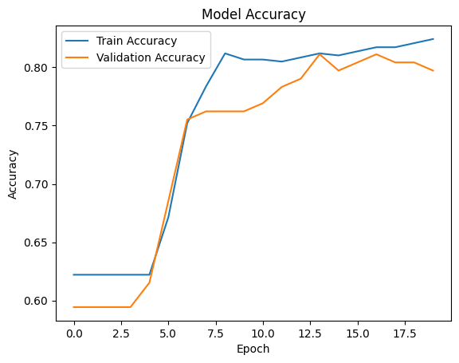
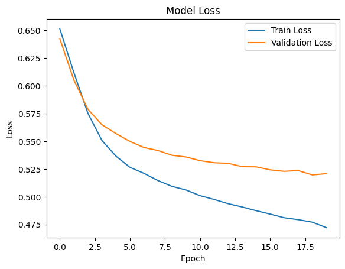
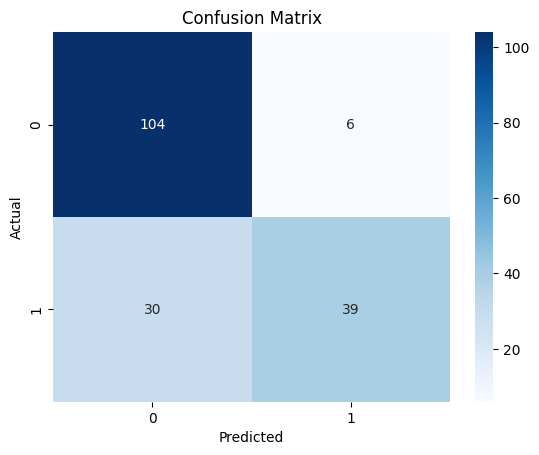

# 🚢 Titanic Deep Learning Classification with Keras

A binary classification project that uses a **Keras neural network** to predict whether a passenger survived the Titanic disaster.

The project follows a simple end-to-end Deep Learning workflow:

**Load Data → Explore Data → Prepare Data → Train/Test Split → Scale Data → Build Neural Network → Train → Evaluate → Predict**

## Project Objective

The target variable is:

- `Survived = 0` → Did not survive
- `Survived = 1` → Survived

The model uses both numerical and categorical passenger information and includes a simple engineered feature called `FamilySize`.

## Dataset

The repository contains:

- `ttrain.csv` — training data with the `Survived` target
- `ttest.csv` — Titanic test data without the target column

The training dataset contains **891 passengers**, while the test dataset contains **418 passengers**.

## Data Preparation

The project includes:

- Missing value analysis
- Median imputation for numerical missing values
- Most-frequent-value imputation for `Embarked`
- Categorical encoding with `pd.get_dummies()`
- Feature scaling with `StandardScaler`

### Feature Engineering

A new feature is created:

```text
FamilySize = SibSp + Parch + 1
```

This represents the total number of family members travelling together, including the passenger.

## Neural Network

The Keras `Sequential` model uses the following architecture:

```text
Input
 ↓
Dense(32, ReLU)
 ↓
Dense(16, ReLU)
 ↓
Dense(8, ReLU)
 ↓
Dense(1, Sigmoid)
```

Training configuration:

- Optimizer: `Adam`
- Loss: `binary_crossentropy`
- Epochs: `20`
- Batch size: `32`

## Model Evaluation

On the held-out test split, the final model achieved:

- **Test Accuracy: 79.89%**
- **Test Loss: 0.5121**

The notebook also includes:

- Accuracy visualization
- Loss visualization
- Classification report
- Confusion matrix

### Accuracy



### Loss



### Confusion Matrix



## Predictions

The trained model predicts survival for the Titanic test dataset and creates:

```text
titanic_submission.csv
```

The notebook also saves the trained neural network as:

```text
titanic_deep_learning_model.keras
```

These files are generated when the notebook is executed.


```

## Technologies

- Python
- Pandas
- NumPy
- Matplotlib
- Seaborn
- Scikit-learn
- TensorFlow / Keras
- Jupyter Notebook

## Project Summary

This project demonstrates a complete and accessible Deep Learning classification workflow, from data exploration and preparation to feature engineering, neural-network training, model evaluation, and final predictions.
